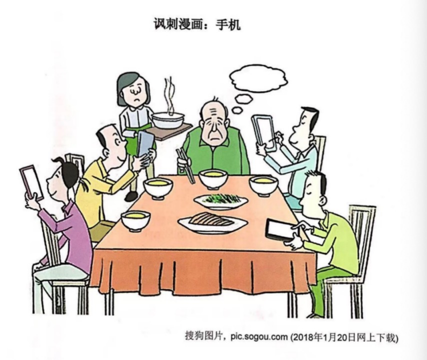

# 议论文
## 人民日报发声：“精日”出没，价值底线不容触碰
>文本以何种方式和技巧表达意旨的？

　　最近，“精日”一词进入公众视野。今天，我们就聊聊“精日现象”。所谓“精日”，意思是在精神上把自己视为日本人。前不久，两名男子在南京抗日碉堡遗址前，身穿仿制二战日本军服；此前，一名上海男子在400余人的微信群中散布“南京杀三十万太少”等言论，都是“精日”的表现。他们也因构成寻衅滋事，被行政拘留。然而，事情不能到此结束，我们需要反思，为何“精日”有生存空间？历史虚无主义因何沉渣泛起？应该如何正确对待历史？  

　　“精日”者，常常身着昔日日军军服，以抗日遗址为背景拍照散播，或者为一些早有定论的历史事件辩护。有人不无惊恐地说，“他们隐藏在你身边，盼着中国亡国灭种”。“精日”群体的所言所行，既不是在文化上的“哈日”群体，也不是出于好奇尝试的cosplay，而更像是带着眼镜看世界的“井中之蛙”。这眼镜上涂抹着片面与偏见，而观察的方位也不过是脑袋朝下看井底。  

　　历史不是被任意拨弄的时间轴线，它有记忆、有情感。然而，近些年来，从微博大V侮辱邱少云烈士到把慰安妇的痛楚画面做成表情包，从去年“四行仓库日军军服合影事件”和这次“紫金山日军军服合影事件”，历史成了一些人的玩物，英雄的精神、家国的情怀在谈笑间被肢解，令人痛心。正是这种历史虚无主义的出现甚至泛滥，一次又一次戳中人们心底的伤痛、触碰民族的价值底线，很容易致使认知错乱、扭曲国家认同。  

　　导演郭柯在谈到电影《二十二》的拍摄故事时说，当有老人愿意讲述细节时，他们选择停机不拍，因为不愿背叛老人的信任；当不少人认为应该以同情眼光看待老人时，他直言“我们只要用笑脸和善意去对待她们就可以了”。这份不经意的温柔，或许是今天我们打开历史书页的一种正确方式。相较于有些人游戏历史、娱乐历史、粉刷历史，或者以所谓“重新评价”“重新发现”的名义来“解构主流”“重构历史”，哪个能真正赢得人心、赢得未来，不言而喻。

　　更重要的是，我们的历史观教育不是够多，而是太少。荷兰作家伊恩·布鲁玛在《罪恶的代价》中提到一件事：1991年的一个夏日，在柏林街头看到一则讲座通知，主题与反思大屠杀相关，原以为不会有太多听众，没料到竟座无虚席，且以年轻人居多。数十年过去了，对遭受战争影响的国家及其国民来说，反思的教育、真相的教育、和平的教育是否足够真诚、足够有效？是否能够从中汲取教训？是否能够不忘走过的路、选对未来的路？这些拷问不是舆情面前的简单问答，而应该是从国家到个体、从法律到治理、从虚拟网络到现实世界中的切实行动。换句话说，要让“精日”无处藏身，以实际行动捍卫历史，才能筑牢精神的高地。

　　龚自珍有言，“欲知大道，必先为史。灭人之国，必先去其史”。正确的历史观与国家的兴衰存亡息息相关。我们选择以什么眼光打量历史、用何种方法解读历史，不仅关乎昨天、今天，更影响到明天。个人不能失去历史记忆，国家和民族不能没有共同记忆，只有用真情守望、用行动守护、让肆意妄为付出代价，才能让“忘记历史就意味着背叛”掷地有声。
　　这正是：历史须尊重，“精日”莫放纵。

　　中华民族的民族尊严不容践踏,中华民族的民族感情不容践踏!作为炎黄子孙,我们每一个人都要爱国,爱国是我们每一个人的义务,抗日战争时期那些汉奸为世人唾骂,是民族的败类,如今这帮"精日"分子比汉奸更可耻,《人民日报》作为党中央的喉舌发声，看来这帮“精日”分子的末日到了。

( 人民日报中央厨房·思聊工作室 李洪兴 )

## 农村衰败真的是坏事吗?

>本文的论点是如何构建、推进和达成效果的? 

文章来源:中国乡村发现 作者:维舟

　　每到了节后返城的时刻，翠花们重新变回了Tracy一一通常还带着回乡见闻的深深感慨。  

　　他们的身份使他们既能作为内部的知情人察觉那些新的变化，又能从一个外部的视角进行评判。这些直观的经验观察有一个常常若隐若现、也容易激发讨论的基调:农村的衰败。随之而来的便是一种对这一状况的深切忧虑、对自己家乡和亲人不幸遭遇的无力感，通常还有一种“美好往昔一去不复返”的失落感。  

　　改变自己家乡落后面貌曾是许多中国知识分子普遍的愿望，但当家乡确实发生改变时许多人的反应却仿佛他们是失落了一个天堂，而不是一个落后的乡村。但这真的是全部事实吗?  

　　故乡的变化究竟是好是坏?  

　　在此必须要事先说明的是，在叙述故乡所发生的变化时，具体有没有变化、发生了什么变化，那是一种事实判断;但这种变化好还是不好，那可就复杂了，它是一种和我们的观念交织在一起的价值判断。  

　　举例来说，如今人们普遍觉得过年不如以往热闹了，年味淡了(事实判断);有些怀念以往那种年味浓厚日子的人认为这是不好的变化，但另一些宁可自己自由过的年轻人却可能觉得这是好事(价值判断)。  

　　明白这两点的区别非常重要，因为很多人在叙述中都会不知不觉将这两者混杂在了一起，平心而论，完全不夹杂自己的价值判断恐怕也极难，甚至根本不可能。并不奇怪的是，越是那些热切关心家乡、对它往日的景象深深怀念的人，就越容易倾向于把现在发生的许多变化看成是“问题”，在与以往那个“淳朴”的乡村作对比时也就更难以接受这些变化，进而忧心忡忡地认为农村是“衰败”了。  

　　问题在于:这个“农村凋敝”的图景常被 (包括这些观察者在内) 误认为是“事实判断”，但其实它们却常常是“价值判断”。  

　　2017年春出版的《大地上的亲人:一个农村儿媳眼中的乡村图景》可能是近年来最完整系统地从这个角度进行叙述的一本书。作者黄灯以三个小地方为观察点，展现了自己乡村里的亲人在现代化进程中的不同命运。  

　　在她看来，农村的问题几乎无所不在:城乡差距拉大，乡村在各方面加深了对城市的依赖;乡村风俗被城市的消费主义和功利主义攻陷，新旧价值观交替之际风气败坏，带来精神上的绝望与无奈:农村组织溃败，缺乏有效监督使农村成为假冒伪劣商品的集散地;完整家庭结构瓦解，造成老无所养和留守儿童;债务、赌博等造成的人伦悲剧和利益纠纷，进一步破坏了熟人社会的关系;资本侵蚀盯上了农村最后的资源一一土地，年轻一代虽有农民身份，却没有了土地，既不会务农也不愿务农:乡村教育资源凋零，教育促进社会流动功能下降，农村家庭无力改变自身命运的结构性困境。  

　　在面对这些问题时，她的心态常常陷入矛盾:她既感慨乡村“垃圾处理的无效和无力”又承认村里的卫生条件比十年前“得到了很明显的改善”:她希望每个人通过自己努力得到改变自己命运的机会，但又忧虑1990年代以来农村人口流动导致传统家庭结构的解体她一方面哀叹现实中教育已越来越难有助于人改变自身命运，但另一面又不断强调应重视教育，然而，最终她又承认教育越成功，优秀人才就越会离开乡村，而不是留下来滋养乡村。  

　　客观地说，她所说的很多现象和问题的确存在，不过，她把故乡原先的状况描述为“人情味极浓、风气良好”，而现状则是“无序、污浊和浮躁”，则是一种宣称为事实判断的价值判断，因为她在比较时，只偏重了其中的一面一一例如，原先那种人情味极浓的社会，可想而知也是对个人束缚更大的社会，而一个“无序”的社会，却能容许个人拥有大得多的自由。  

　　我们所身处的当下，是一个剧烈变革的时代，在这样的洪流中，一切坚固的东西都烟消云散了，这是一个公认的事实，但对此的反应则因人而异。

---

# 新闻
## 山东一卫校被指劝退体育不及格学生 校方称其中有误会

>文本以何种方式呈现因体育成绩不达标学校与学生之间的争论的?  

来源：北京青年报 作者：张雅 时间：2017-06-12 15:55:15

体育考试“补考不及格者将被劝退”，近日一则通知截图，让山东日照市卫生学校陷入争议中。对此，日照卫校政教处一名工作人员回应北京青年报记者称，网传“劝退”规定系误传，如学生体质存在重大缺陷，“确实不适合学医”，会劝导学生转换专业，但校方不会仅仅因为体育成绩不达标而要求学生退学。
　　
### “体育考试不及格被劝退”引热议

　　北青报记者获得的一张通知截图显示，有老师在学生群内通知称，“本次体育期末考试及两次补考仍不合格者要召开家长会，宣布处理决定。病假者将病历交由学校研究处理。因身体原因实在不能参加体育锻炼者劝其退学”。有学生指出，通知系由山东省日照市卫生学校发布。

　　对此，多名日照卫校学生通过网络，表达担忧与疑惑。有学生表示，“上了三年，现在说体育不及格要退学，我也好无奈。”还有网友调侃称，自己上的“不是卫校，而是体校”。事件曝光后引发众多网友关注，有网友疑问事件是否属实，并对学校的做法提出质疑。
　　
### 有涉事学校学生自称“被口头劝退”

　　日照卫校一名王姓学生告诉北青报记者，自己的班主任也在班级群里发过类似内容。王姓学生表示，“劝退”新规是在6月5日，即体育期末考试后发布的，而且“突然通知不及格的会被劝退”，此前并未与学生打过招呼。

　　根据王姓学生的介绍，学校体育测试“新规”要求，学生在3分50秒之内跑完800米，8秒内跑完60米，立定跳远需达到1.7米。如果不及格，就需要补考，补考再不及格，则“让家长过来陪考”。如果至此仍然不及格者，将直接被学校劝退。

　　王姓学生称，自己在参加体育考试时，由于生病，在中途就“跑不动了”，随后便停了下来，走了一会儿之后，被在操场检查的校长看到，于是便被叫去谈话。“他（校长）的意思就要劝退我，还告诉了我的班主任，让我等处理结果。”他有些无奈。
　　
### 校方称不会因体育成绩不达标劝退

　　对于“新规”以及通知截图引发的关注，日照卫校政教处一名工作人员向北青报记者表示，教务处确曾将这条“新规”发给各个老师，再由老师发到所在班级群中。不过，这名工作人员强调，学校“肯定不会用这样的规定去为难学生”，也“从来不会因为学生体育成绩不达标而劝退”。

　　日照卫校将所发通知解释为：由于部分学生沉迷于手机和网络，学校为加强学生素质，也出于对学生职业发展的考虑，所以才出台了一系列的规章制度。

　　上述工作人员告诉北青报记者，目前学校处于期末考试阶段，学生正在陆续进行体育测试。如果本次期末考试不达标，开学两周后会有一次补考。“没有别的处罚措施，也从来没有过。”工作人员表示，若通过体测发现有些学生“不能胜任护理工作”，“体质有重大缺陷，不适合学医”，学校或将劝导其转换至对身体素质要求不那么高的专业，但并不会仅仅因为体育成绩不合格而劝退学生，“不要让学生误解了”。

北青报记者了解到，对于体质不达标的学生，日照卫校将与学生及其家长进行沟通，争取共同意见来作进一步的调整。而对于校长“口头劝退”学生，校方则回应称，是“话有些重，但是为学生好”。 

( 记者 张雅 实习记者 刘思佳 )

---
# 漫画

