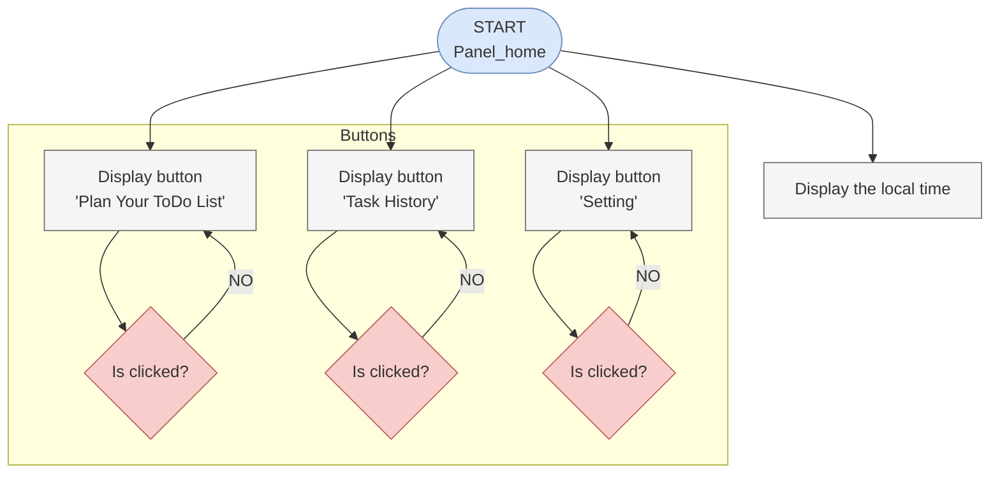

# IA flowchart
## Main page's function

```mermaid
flowchart TD
    
    classDef Start fill:#DAE8FC, stroke: #6C8EBF
    classDef ProcessDisplay fill:#F5F5F5, stroke: #666666
    classDef ProcessJump fill:#DAE8FC, stroke: #6C8EBF
    classDef Decision fill:#F8CECC, stroke: #B85450
    

    START(["START
    Panel_home
    "]):::Start

    Display_LocalTime["Display the local time"]:::ProcessDisplay

    Display_Button_PlanYourToDoList["Display button
    'Plan Your ToDo List'"]:::ProcessDisplay

    Display_Button_TaskHis["Display button
    'Task History'"]:::ProcessDisplay
    
    Display_Button_Setting["Display button
    'Setting'"]:::ProcessDisplay
    

    Dsi_Button_PlanYourToDoList{"
        Is clicked?"}:::Decision
    Dsi_Button_TaskHistory{"
        Is clicked?"}:::Decision
    Dsi_Button_Setting{"
        Is clicked?"}:::Decision

    START-->Display_LocalTime
    START-->Display_Button_PlanYourToDoList
    START-->Display_Button_TaskHis
    START-->Display_Button_Setting

    subgraph Buttons
        Display_Button_PlanYourToDoList-->Dsi_Button_PlanYourToDoList--NO-->Display_Button_PlanYourToDoList

        Display_Button_TaskHis-->Dsi_Button_TaskHistory--NO-->Display_Button_TaskHis
        Display_Button_Setting-->Dsi_Button_Setting--NO-->Display_Button_Setting
    end 
    


    


```