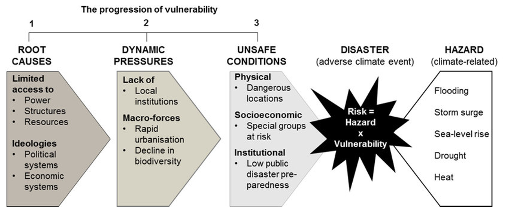

# Topic 2 Global Climate
## Which factors would contribute to different effects under the same climate change?  
Levels of climate change risk and vulnerability will vary according to a ***person's location***, ***wealth***, ***social diferences*** (age, gender, education) and ***risk perception***.  

## Disparities in exposure to climate change  
Some population groups are more vulnerable to climate change than others.
* The elderly
* Those with disability
* The poor
* The young
* Minority groups
* Refugees
* Single-parent households
* ***Indigenous people 土著*** 
  * Indigenous people often live in extreme environments. In addition, they often experience socio-economic problems such as low incomes, poor health and limited access to resources, including water. These factors make them vulnerable to climate change.  
  * Most indigenous population have adapted their lifestyles to their environment, and they are therefore vulnerable to any changes in that environment.  

    > ### Case Study: The Inuit people in the Mackenzie Basin in Canada
    >  
    > A rise in temperature of about 3.5 °C since the 1980s. This has caused permafrost to melt, changing the ecosystem and leading to an increase in landslides and forest fires, and reduced water availability.  
    >
    > It is likely that many Inuit will have to abandon their traditional lifestyle and seek employment in urban areas instead, which will lead to the destruction of their cultural heritage and values.  

>### Suggest two social factors that influence disparities in exposure to climate change risk?  
>
>The density of population and living conditions increase ris. For example people living in high density shanty towns on steeps slopes are at risk from landslides that happen during intense rainfall and storms.  
>
>Another social factor is how old people are, young children and the elderly are more at risk from extreme hot weather. They are more susceptible to dehyfration.  
>
> The density of population and living conditions increase risk. For example, people living in high density shanty towns on steeps slopes are at risk from landslides that happen during intense rainfall and storms. 
> 
> Age strucutre of the population can influence risk levels to climate change. Aging population are more vulnerable to heat stress and dehydration and are dependent on their network of support. This is often greatest in remote rural regions where social support is lacking.   
>
> Women can be more exposed to climate change risk dur to discriminatory laws that prohibit them from land tenure and access to credit and favor men. This leaves them more vulnerable during times of hardship, for example a flood caused by climate change. With a lack of access to credit they are unable to finance their recovery.  

**Some locations are more at risk than others**  
* Low-lying islands
* River mouths
* Coastal areas
* Valleys
* Area derive water from ountain glaciers  

>### Explain two ways location can determine the level of risk to climate change  
>At the global scale people living in the global south in less developed countries are more exposed to the risks of climate change. It is regions such as Sub-Saharan Africa that will be exposed to ectreme droughts, increasing water and food stress.  
>
>People living in low lying regions such as the Kiribati Island, in the Pacific and Bangladesh are more exposed to the threat of sea level rise. These countries are exposed to the risk of floods, storm surges and salt intrustion, with risks to health, shelters and food production. 
>
>Developing countries are more exposed to the riskks of climate change. They don't have the resources to prepare or manage extreme hazards, like hurricane. Richer countries can build large sea walls that protect cities from floods. 
>
>In some places the poorest places are more exposed to risks. One example of this was New Orleans during Hurricane Katrina. The poorest, African-American communities were most exposed because they lived in the low-lying parts of the city and couldn't afford or saw no reason to evacuate.  

**Problems low-lying islands may faces**  
* Increased coastal erosion  
* Saline intrusion into groundwater supplies
* Deterioration of coral reefs
* Out-migration of people 
* Loss of income as a result of a decline in economic activities and infrastructure  

A number of index's are used that attempt to measure ***exposure and vulnerability*** to climate change.  

This index takes into both ***the exposure of a population to the hazards*** of climate change as well as its ***ability to respond and show resilience***. 

* Change of cereal yields  
* Change of marine biodiversity 
* Dam capacity
* Rural population 
* Change of flood hazard
* Child malnutrition 
* Age dependency ratio
* Medical staff
* Access to reliable Drinking water
* Change of sea level rise impacts
* Paved roads
* Change in vector-born diseases 
* Electricity access
* Rule of law
* Slum population 
* Education
* Innovation 
* ...

Most at risk countries are distributed in ***Africa*** and ***across South*** and ***South East Asia***.  

### Factors that influence vulnerability  
Climate change places stress on countries through **environmental degradation** and *expisure to environmental risks*, that include extreme weather events, sea level rise, food and water insecurity.   

The exposure to risk is compounded by **environmental** and *socio-economic* factors within the country.  

The index refers to ***vulnerability indices*** that include:
* food
* water
* health
* ecosystem services
* human habitat 
* infrastructure

It also refers to *readiness indices*, related to adaptation capacity that include: 
* economic cohesion
* governance cohesion
* social cohesion

An intersting theoretical model concerning vulnerability and risk that is helpful can be found in the ***Pressure-Release Model***.

### Stage 1 Root Casuse
Issues of ***governance and economic development***.  

### Stage 2 Dynamic Pressures
Lack of ***effective institutions*** and agencies.  
Processes of ***rapid change*** such as: 
1. Population growth
2. Migration
3. Changes in land used, such as deforestation. 

### Stage 3 Unsafe Conditions 
***Environmental*** conditions, such as:
1. Landslides
2. Saline intrustion 
3. Exposure to disease
   
***Social*** conditions, such as:
1. Lack of trust in authorities
2. High levels of poverty 
3. Poor social cohesion

These factors all impact on ***the resilience of a community*** to respond and recover from climate change events. When these factors combine with a climate disaster such as flood or drought communities are crushed from both sides.  

>### Case Study: Bangladesh  
> High *vnlnerability* score (0.546)  
> Low *readiness* score (0.267)
> * High rural population
> * High levels of child mortality 
> * High water dependency ratio with low levels of economic capacity to store and transport water
> * High density populations in poorly resourced slums
> 
